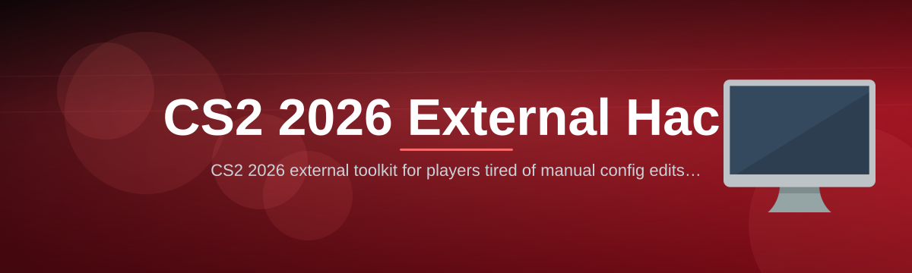

 

  
  
  

  

  
  
  
  

---

## 🗺️ Table of Contents

| Section | What you will find |
|---|---|
| [What is CS2 2026 External Hack?](#-what-is-cs2-2026-external-hack) | Plain-English explanation, glossary and payoff list |
| [Download the 2026 Build](#-download-the-2026-build) | Package contents and the first download line |
| [The Problem](#-the-problem) | Where stock CS2 tooling stops short in 2026 |
| [The Solution](#-the-solution) | How the toolkit answers each gap |
| [Installation](#-installation) | Three numbered sub-steps, no build tools required |
| [Quick Start](#-quick-start) | Running in under two minutes |
| [Visual Intelligence Modules](#-visual-intelligence-modules) | 6 named modules |
| [Aim Assistance Modules](#-aim-assistance-modules) | 5 named modules |
| [Radar and Intel Modules](#-radar-and-intel-modules) | 5 named modules |
| [Movement and Utility Modules](#-movement-and-utility-modules) | 5 named modules |
| [Economy and Buy Modules](#-economy-and-buy-modules) | 5 named modules |
| [HUD and Interface Modules](#-hud-and-interface-modules) | 5 named modules |
| [Automation and Macro Modules](#-automation-and-macro-modules) | 5 named modules |
| [Maintenance and Safety Modules](#-maintenance-and-safety-modules) | 5 named modules |
| [Module Status Board](#-module-status-board) | Current build status per module |
| [Default Hotkeys](#-default-hotkeys) | The key map shipped with v2.6 |
| [Compatibility and Platform Support](#-compatibility-and-platform-support) | OS, client and mode support |
| [System Requirements](#-system-requirements) | Minimum versus recommended |
| [Known Issues](#-known-issues) | The five most reported problems and their fixes |
| [FAQ](#-faq) | Nine collapsible answers |
| [Tips for Best Results](#-tips-for-best-results) | Tuning checklist |
| [Project Overview](#-project-overview) | Release metadata at a glance |
| [Usage Guidelines](#-usage-guidelines) | Allowed versus not allowed |

---

## 🎯 What is CS2 2026 External Hack?

**CS2 2026 External Hack** is a standalone Windows toolkit that reads Counter-Strike 2 game state from outside the process and draws its own overlay on top of the client — no game files are modified, and nothing is installed into the CS2 directory. It ships as a single portable `.exe` with a module catalog of **41 named features**, a config profile manager, and a self-check that verifies every component before the overlay attaches.

Two sentences is all it takes: you download one folder, run one `.exe`, and the toolkit handshakes with the running CS2 client through a signed overlay channel. From there, every visual, aim, radar and economy module is toggled from an in-game panel that you can theme, hotkey, and export as a shareable profile.

**Term | Explanation**

| Term | Explanation |
|---|---|
| **External** | Runs as a separate Windows process and reads memory from outside the game, rather than injecting a library into the CS2 client |
| **Overlay** | A transparent always-on-top window that draws boxes, tags and timers over the game surface |
| **ESP** | "Extra Sensory Perception" — the family of visual modules that render player boxes, skeletons and health bars through walls |
| **FOV** | Field of view cone, expressed in degrees, that limits how far from your crosshair an aim module will consider a target |
| **Profile** | A saved `.cfg` bundle containing every module toggle, color, keybind and slider you have set |
| **Tick / Interp** | The server update rate and client interpolation window; both affect how "live" overlay positions feel at high ping |
| **Self-Check** | The pre-flight routine that validates overlay hooks, config schema and signature state before anything renders |

**Why people keep it in their folder**

- One `.exe`, one config folder, zero dependency installers or runtimes to hunt down.
- 41 modules grouped into eight categories, so you can run four of them or all of them.
- Profiles are portable plain text — copy one file to a new machine and your setup follows.
- The overlay renders on its own thread, so the client frame time is not the bottleneck even with every visual module on.
- Every release ships with a changelog and a module status board so you know exactly what changed.

---

## 🎁 Download the 2026 Build

The public package is a single compressed folder. It contains the `.exe`, a `configs/` directory seeded with three starter profiles, a `modules/` folder with the module manifests, and a short `READ-ME-FIRST.txt`.

**What is inside the archive**

| Item | Purpose |
|---|---|
| The `.exe` | Main overlay host — launch this after CS2 is running |
| `configs/` | Three starter profiles: `default`, `stream-safe`, `minimal-visual` |
| `modules/` | Module manifests that the host reads on startup |
| `logs/` | Created on first run; holds self-check and crash output |
| `READ-ME-FIRST.txt` | 12-line quick reference, mirrors the Quick Start below |

  

---

## 🧩 The Problem

If you have spent any time looking for an external companion for CS2 in 2026, you already know the shape of the frustration. The niche has a few very specific pain points:

- **Everything is bundled with something you did not ask for.** Most packages ship as a loader that drags in a browser extension, a background service, or a "helper" that phones home every launch.
- **The overlay fights the client.** Fullscreen exclusive mode, HDR, and multi-monitor arrangements break naive overlay windows, so half the tools on the market only work borderless.
- **No module granularity.** You get "ESP on/off" and that is it — no per-element control over health bars, weapon tags, or distance readouts.
- **Configs disappear between sessions.** Keys reset, colors reset, sliders reset, and there is no export path.
- **Documentation is a Discord message.** Update notes are three lines long, and nothing tells you which module is broken in the current build.
- **Updates are manual and scary.** You overwrite the `.exe`, lose your settings, and find out at match start that the new build behaves differently.
- **Performance cliffs at 300+ FPS.** Between the game, the overlay and a capture layer, frame pacing collapses on mid-range hardware.

---

## 🧠 The Solution

Each problem above maps to something specific in this repository's release, not a vague promise.

| Problem | Solution |
|---|---|
| Bloat and bundled extras | The package is the `.exe` plus a config folder. Nothing installs to `Program Files`, nothing registers a service, nothing touches your browser. |
| Overlay breaks in fullscreen | The host uses a layered, per-monitor-aware surface that re-anchors on resolution and display-mode changes rather than assuming a fixed window size. |
| No module granularity | 41 modules are individually toggleable, and visual modules expose sub-toggles for every drawn element. |
| Configs reset | Profiles are written to `configs/` as plain text on every change, and the Config Profile Manager can export or restore them by hand. |
| Thin documentation | This README carries the glossary, status board, hotkey map, compatibility matrix, known issues and a nine-question FAQ. |
| Manual, lossy updates | The Auto Updater replaces the host binary, leaves `configs/` untouched, and writes a diff summary into `logs/`. |
| Frame pacing collapse | Overlay drawing is thread-separated from the reader, with a frame-time budget that degrades element count instead of dropping frames. |

---

## 📦 Installation

Three numbered sub-steps. No package manager, no compiler, no command line.

**1. Extract the archive.**
Right-click the downloaded archive and choose *Extract All*, then pick a folder you can write to — a user folder such as `Documents\cs2-toolkit` is ideal. Do **not** extract into `Program Files` or into the CS2 install directory; the toolkit never needs to live next to the game and writing into protected paths is the single most common cause of a failed first launch.

**2. Start CS2 first, then the `.exe`.**
Launch Counter-Strike 2 and get to the main menu. Then run the `.exe` from the extracted folder. On the first launch, Windows may show a SmartScreen prompt because the binary is not code-signed by a commercial publisher — choose *More info* then *Run anyway*. The host will perform a self-check, print the result into `logs/selfcheck.log`, and only then attach the overlay.

**3. Load a profile and confirm the overlay.**
Open the panel with the default menu key, pick one of the three starter profiles, and press the toggle key for a visual module. If boxes appear on a bot in a private match, installation is complete. Your chosen profile is saved automatically and reused on the next launch.

> Run in borderless or windowed fullscreen for the first session. Once the overlay is confirmed working, you can switch to fullscreen exclusive and re-run the self-check.

---

## 🖱️ Quick Start

1. 🗂️ **Extract** the archive to a writable folder like `Documents\cs2-toolkit`.
2. 🎮 **Launch CS2** and wait until the main menu finishes loading.
3. 🖱️ **Run the `.exe`** — accept the SmartScreen prompt on first launch only.
4. 🧾 **Check `logs/selfcheck.log`** for `overlay: ready` before joining anything.
5. 🎛️ **Load a profile** from the panel, or start from `minimal-visual` if you want a quiet first match.
6. 🔑 **Bind your own keys** from the Hotkeys tab and save the profile.

---

## 🎨 Visual Intelligence Modules

The visual layer is the heart of the toolkit and the reason most people keep it open. Every element below is drawn by the overlay, not the game, so you can switch any of them off without restarting the client. Colors, thickness and opacity are per-element, and the renderer clamps itself to a frame-time budget so a busy scene degrades gracefully instead of stuttering.

- **Player ESP** — Draws a boundary box around every visible or occluded enemy, with adjustable corner-only or full-rectangle style.
- **Skeleton ESP** — Renders a joint-to-joint line model so you can read stance, peek direction and crouch state at a glance.
- **Health and Armor Bars** — Vertical or horizontal bars anchored to each box, with numeric readouts and a low-HP color shift.
- **Name and Weapon Tags** — Shows player name, active weapon and a compact ammo counter beneath the box.
- **Distance Readout** — Live meter figure in world units and meters, with a configurable visible-range cutoff.
- **Visibility Shading** — Dims occluded targets so a wall-hugging enemy reads differently from one in the open, without hiding either.

---

## ⚔️ Aim Assistance Modules

This group is deliberately conservative by default: every module starts disabled and every one is bounded by an FOV cone you set yourself. The aim layer reads the same target list the visual layer uses, so anything you can see in a box is a candidate — and anything outside your cone is not. Smoothing curves are applied per-tick rather than per-frame, which keeps the motion consistent whether you are running at 144 or 400 FPS.

- **Aim Assist** — Applies a bounded angular correction toward the highest-priority target inside your FOV cone, with separate horizontal and vertical strength sliders.
- **Trigger Assist** — Fires on crosshair-overlap within a millisecond window you define, gated by a hold key so it never runs unattended.
- **Recoil Compensation** — Applies a counter-pattern derived from the active weapon's spray profile, with intensity scaling per shot index.
- **FOV

  

